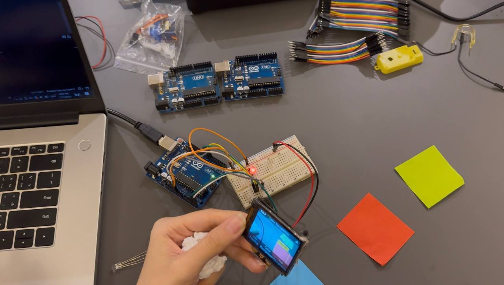

# Color-Recognition-Using-HuskyLense-a-Arduino
AI-powered color recognition system using HuskyLens and Arduino with real-time RGB LED feedback.

# 🎨 AI Color Recognition Using HuskyLens & Arduino

An AI-powered color recognition system developed using HuskyLens and Arduino Uno. The project demonstrates how embedded AI vision can detect and classify colors in real time without requiring cloud processing.

---

## 📌 Project Overview

This project uses the HuskyLens AI Vision Sensor in Color Recognition Mode to identify different colors and communicate the detection results with an Arduino Uno.

The system can recognize trained colors in real time, making it suitable for robotics, smart automation, sorting systems, educational applications, and computer vision projects.

---

# 📸 Project Preview

## Hardware Setup

  

---

## Color Recognition Example

  

---

# 🎥 Demonstration Video

Watch the project in action:

📹 ColorRecognition-Result.MP4

> GitHub allows downloading the video directly from this repository.

---

# ⚙️ Hardware Components

- Arduino Uno
- HuskyLens AI Camera
- USB Cable
- Jumper Wires
- Computer
- Arduino IDE

---

# 💻 Software

- Arduino IDE
- HuskyLens Library
- Wire Library (I2C)

---

# 📂 Repository Structure
Color-Recognition-Using-HuskyLens/
│
├── HuskyLense-ColorRecognition.ino
├── HuskyLens.jpg
├── huskylenseExample.jpg
├── ColorRecognition-Result.MP4
└── README.md

---

# 🧠 How It Works

1. Connect the HuskyLens camera to the Arduino Uno via I2C.
2. Train the HuskyLens to recognize different colors.
3. Upload the Arduino program.
4. The camera detects the trained color.
5. Detection information is sent to the Arduino in real time.
6. The Arduino processes the received data and displays the result through the Serial Monitor.

---

# ✨ Features

- Real-time AI color recognition
- Embedded computer vision
- Easy hardware setup
- Fast communication using I2C
- Expandable for robotics applications
- Beginner-friendly implementation

---

# 📚 Skills Demonstrated

- Embedded Systems
- Arduino Programming
- Computer Vision
- Artificial Intelligence
- I2C Communication
- Hardware Integration
- AI Sensor Interfacing

---

# 🚀 Applications

- Smart Robots
- Color Sorting Systems
- Industrial Automation
- Smart Manufacturing
- Educational Robotics
- AI Vision Projects
- Object Classification

---

# ▶️ Getting Started

### Clone the repository
git clone https://github.com/yourusername/Color-Recognition-Using-HuskyLens.git

### Open
HuskyLense-ColorRecognition.ino

### Install Library

Install the HUSKYLENS library from the Arduino Library Manager.

### Upload

Upload the sketch to your Arduino Uno.

### Train HuskyLens

Select Color Recognition Mode on HuskyLens and train the colors before running the program.

---

# 📖 Learning Outcomes

Through this project I learned:

- AI vision fundamentals
- Embedded AI applications
- Arduino-HuskyLens communication
- Color recognition using machine vision
- Real-time sensor integration
- Embedded programming with Arduino

---

# 📄 License

This project is available for educational and learning purposes.

---
## 👩‍💻 Author

Manar

Computer Engineering Student

Full Stack Engineer Intern

Embedded Systems • Robotics • AI • IoT
